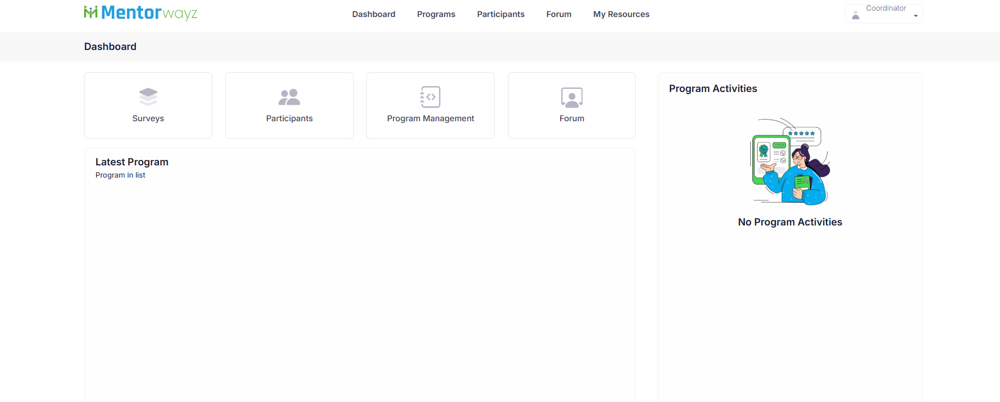
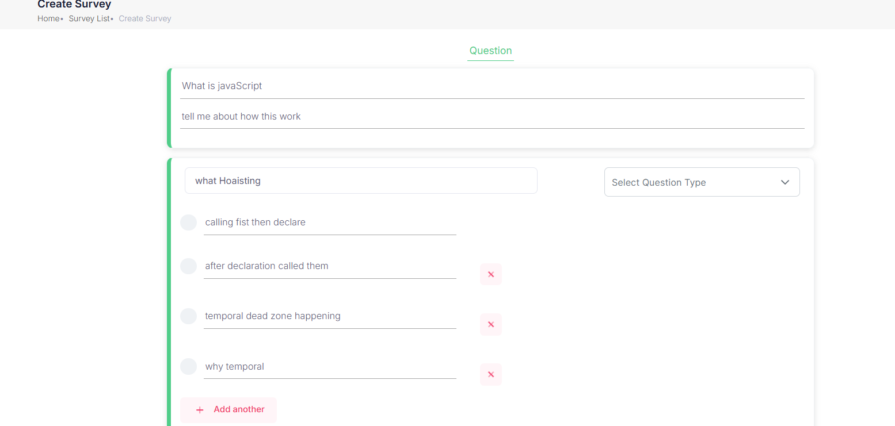
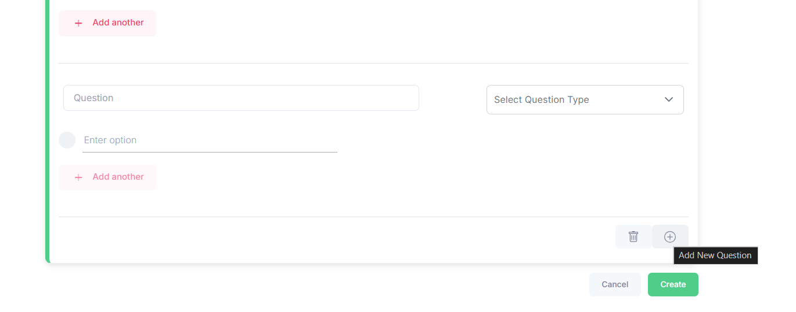
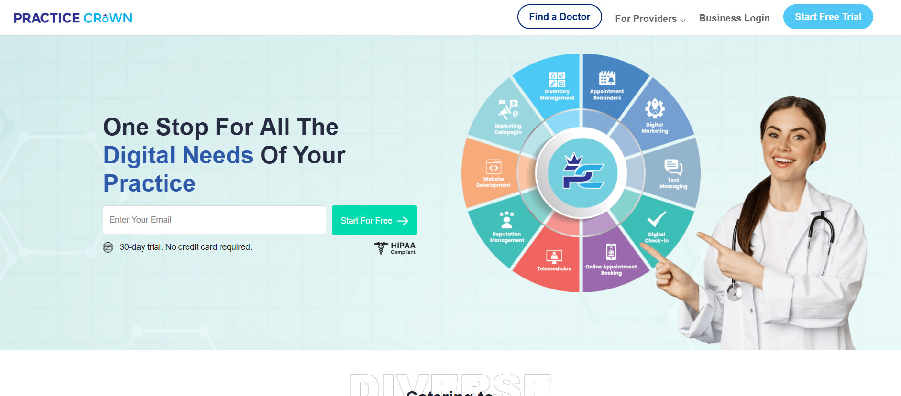

# 🚀 MentorWays Project Showcase  
**Mentorship & Learning Platform | Production SaaS**

> A real-world, production-ready mentorship platform built with **Angular 16**, focused on scalability, performance, and clean frontend architecture.

---

## 🔗 Project Status
**Live Production Product (Company SaaS)**  
Screenshots below demonstrate real implemented features.

---

## 🧠 Project Overview
**MentorWays** is a full-scale mentorship and learning platform designed to connect learners with industry mentors through structured programs, surveys, bookings, and role-based dashboards.

The application handles complex workflows such as mentor onboarding, learner enrollment, survey creation, scheduling, and admin operations — all built with a scalable and maintainable frontend architecture.

---

## 👨‍💻 My Role
**Senior Frontend Developer**  
📍 Worked on **live production features end-to-end**

---

## 🛠️ Key Responsibilities
- Designed and developed **scalable & reusable Angular components**
- Built **complex multi-step forms** with dynamic validation
- Implemented **role-based dashboards** (Admin / Coordinator / Mentor / Learner)
- Integrated **secure REST APIs** with authentication & authorization
- Optimized UI performance using RxJS best practices
- Improved UX, accessibility, and responsiveness
- Collaborated with backend, design, and product teams in Agile environment

---

## ⚙️ Tech Stack
- **Angular 16**
- TypeScript
- RxJS
- Angular Material / SCSS
- REST APIs
- Git, Agile & Scrum workflow

---

## ✨ Key Features I Contributed To
- Mentor onboarding & profile management
- Coordinator dashboard development
- Complex survey creation & management UI
- Program enrollment workflows
- API-driven dynamic forms
- Dashboard performance optimization

---

## 📸 Screenshots

### 🧭 Coordinator Dashboard


---

### 📋 Survey Creation (Complex Dynamic Forms)


---

### 📊 Survey Configuration & Validation


---

## 🧪 Development Setup

### Prerequisites
- Node.js (v18+ recommended)
- Angular CLI `v19.1.6`

---

### Install Dependencies
```bash
npm install


### Additional Project: Practice Crown
Live URL: https://practicecrown.com/
-> use Angular 16 NgRx, Rxjs, Typescript.

 // 
Live URL: https://practicecrown.com/



## 🛠️ Key Responsibilities of Practice-crown
- Implemented NgRx Store
- Built reusable and maintainable UI components
- IManaged complex state flows efficiently
- Focused on performance optimization and clean architecture

📌 Why This Project Matters:
✔ Real production experience
✔ Scalable frontend architecture
✔ Complex forms & dashboards
✔ Strong Angular, RxJS & NgRx expertise


---

### ✅ Next Level (Optional – tell me if you want)
- ⭐ GitHub badges (Angular, TypeScript, Build, License)
- 📐 Architecture diagram section
- 📊 Performance & optimization metrics
- 📄 Resume-aligned README version

This README is **resume-grade + recruiter-approved** 💼🔥
::contentReference[oaicite:0]{index=0}
